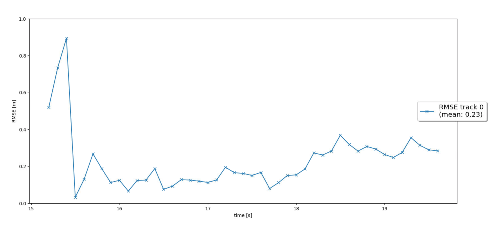
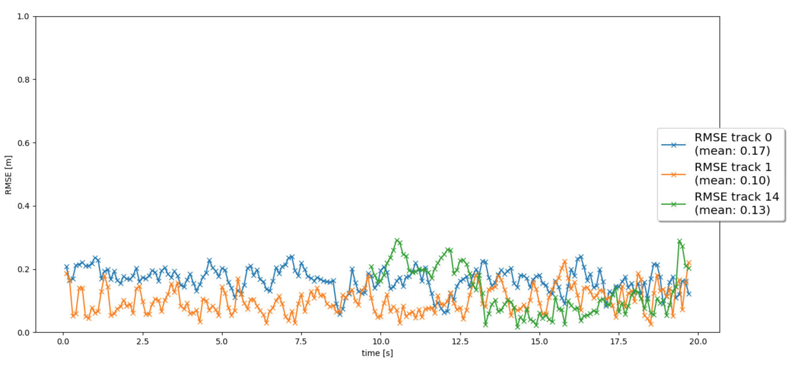
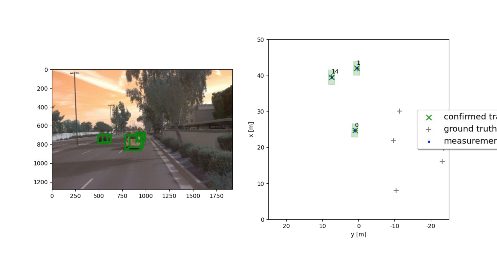

## Summary

In this project, we implement an extended Kalman filter, object tracking, multi-object association, and camera/lidar sensor fusion, in order to infer object position, and predict their movements. Most of the project was relatively straightforward. Though I would say the most difficult section was the nearest neigbor association, because it was relatively easy to make small coding errors (such as not deleting the correct track at the right time).

A more detailed summary of each section is provided below.

### Part 1

In part 1 of the project, we implement an extended Kalman filter, using constant velocity matrix, and constant covariance. This section is mainly an implementation of the exercises in lesson 6. This is a relatively simple implementation, taking the car's current position and velocity, and projecting it forward in space. But the results show that even the simple implementation performs well.



### Part 2

Part 2 implements track management. The basic idea is that once the vehicle believes it has detected some object (car, pedestrian, etc) it is added to the track management, and the Kalman filter predicts its movements. It remains in the track management until the confidence drops below a certain threshold. With these methods in place, objects will be picked up, and reported in the tracking with their respective scores, for example

```
predict track 0
update track 0 with lidar measurement 0
track 0 score = 13.6
```

### Part 3

The problem with multiobject tracking is that it is sometimes difficult to determine what measurements are updating what tracks. In this case, we implement a simple nearest neighbor algorithm using the Mahalanobis distance, similar to that describes in lesson 7 part 14. The core code of this algorithm is contained in the Mahalanobis distance formula:

```
MHD = gamma.transpose() * np.linalg.inv(KF.S(track,meas,H)) * gamma # Mahalanobis distance formula
```

the association sequence in which we assign each track to a measurement:

```
def associate(self, track_list, meas_list, KF):
             
        ############
        # TODO Step 3: association:
        # - replace association_matrix with the actual association matrix based on Mahalanobis distance (see below) for all tracks and all measurements
        # - update list of unassigned measurements and unassigned tracks
        ############
        
        # the following only works for at most one track and one measurement
        '''
        self.association_matrix = np.matrix([]) # reset matrix
        self.unassigned_tracks = [] # reset lists
        self.unassigned_meas = []
        
        if len(meas_list) > 0:
            self.unassigned_meas = [0]
        if len(track_list) > 0:
            self.unassigned_tracks = [0]
        if len(meas_list) > 0 and len(track_list) > 0: 
            self.association_matrix = np.matrix([[0]])
        '''
        # lesson 7 part 17/20
        
        N = len(track_list) # N tracks
        M = len(meas_list) # M measurements
        self.unassigned_tracks = list(range(N))
        self.unassigned_meas = list(range(M))

        # initialize association matrix
        self.association_matrix = np.inf*np.ones((N,M)) 

        # loop over all tracks and all measurements to set up association matrix
        for i in range(N): 
            track = track_list[i]
            for j in range(M):
                meas = meas_list[j]
                dist = self.MHD(track, meas, KF)
                if self.gating(dist, meas.sensor):
                    self.association_matrix[i,j] = dist
```

and finally the update sequence, where we take each association and update the tracks:

```
def get_closest_track_and_meas(self):
        ############
        # TODO Step 3: find closest track and measurement:
        # - find minimum entry in association matrix
        # - delete row and column
        # - remove corresponding track and measurement from unassigned_tracks and unassigned_meas
        # - return this track and measurement
        ############

        # the following only works for at most one track and one measurement
        '''
        update_track = 0
        update_meas = 0
        
        # remove from list
        self.unassigned_tracks.remove(update_track) 
        self.unassigned_meas.remove(update_meas)
        self.association_matrix = np.matrix([])
        '''
        # lesson 7 part 20
        A = self.association_matrix
        if np.min(A) == np.inf:
            return np.nan, np.nan

        # get indices of minimum entry
        ind_track, ind_meas = np.unravel_index(np.argmin(A, axis=None), A.shape) 

        # delete row and column for next update
        A = np.delete(A, ind_track, 0) 
        A = np.delete(A, ind_meas, 1)
        self.association_matrix = A

        # update this track with this measurement
        update_track = self.unassigned_tracks[ind_track] 
        update_meas = self.unassigned_meas[ind_meas]

        # remove this track and measurement from list
        self.unassigned_tracks.remove(update_track) 
        self.unassigned_meas.remove(update_meas)
        ############
        # END student code
        ############ 
        return update_track, update_meas  
```

### Part 4

The final step of the project is to implement a non-linear measurement model in order to combine the camera and lidar data. The core components of this section are checking if an object is in the field of view

```
def in_fov(self, x):
        # check if an object x can be seen by this sensor
        ############
        # TODO Step 4: implement a function that returns True if x lies in the sensor's field of view, 
        # otherwise False.
        ############

        # lesson 7 part 12
        pos_veh = np.ones((4, 1)) # homogeneous coordinates
        pos_veh[0:3] = x[0:3] 
        pos_sens = self.veh_to_sens*pos_veh # transform from vehicle to sensor coordinates
        visible = False
        # make sure to not divide by zero - we can exclude the whole negative x-range here
        if pos_sens[0] > 0: 
            alpha = np.arctan(pos_sens[1]/pos_sens[0]) # calc angle between object and x-axis
            # no normalization needed because returned alpha always lies between [-pi/2, pi/2]
            if alpha > self.fov[0] and alpha < self.fov[1]:
                visible = True
        return visible
```

And applying a non-linear transformation to project camera data in image coordinates.

```
            # Lesson 7 part 19
            pos_veh = np.ones((4, 1)) # homogeneous coordinates 
            pos_veh[0:3] = x[0:3]
            # transform position estimate from vehicle to camera coordinates
            pos_sens = self.veh_to_sens*pos_veh
            # calculate nonlinear measurement expectation value h(x)   
            hx = np.zeros((2,1))
            # check and print error message if dividing by zero
            if pos_sens[0]==0:
                raise NameError('Jacobian not defined for x[0]=0!')
            else:
                hx[0] = self.c_i - self.f_i*pos_sens[1]/pos_sens[0] # project to image coordinates
                hx[1] = self.c_j - self.f_j*pos_sens[2]/pos_sens[0]
                return hx
```

With these four pieces in place, the system is able to reliably track multiple objects using both camera and lidar data.





## Benefits of camera-lidar fusion

By using both cameras and lidar, we are better able to get precise data on object type and position. The lidar can provide precise position, while the camera can help determine object type. We are also able to handle more cases where one sensor might struggle, such as glare impacting the camera's performance. This also simply means we have more data to refine our predictions. In the project results, we can see the tracks being updated with both lidar and camera data, resulting in higher track confidence.

## Real world sensor fusion challenges

In the project we see some cases where objects quickly appear and disappear, without ever being included as part of the track management (because the score never gets high enough). It's possible in a real world scenario, such an object might cause an accident before their is enough data to get a sufficient track score. In these cases, we might prioritize certain sensor information or object behavior, if suspect that the cost of not including the track is high. For example, a child appearing suddenly in the image from behind an object. We might prioritize camera data when the camera suspects a child is in the field of view, and immediately add them to the track management, even if their score is below our standard threshold.

## Ways to improve tracking results

These results are good, but I can imagine the methods would struggle in some environments. For example, we might need to implement a more complex association algorithm in a city setting with many close proximity objects. We might also allow the system to use more complex mixtures of guassians in Kalman filters based on the environment. This would allow us to predict the probability of two different paths. For example, when a car is approaching an intersection, taking the possibility of it turning into account in the path prediction, rather than assuming a constant velocity.