# Writeup: Track 3D-Objects Over Time - Midterm Project

All corresponding code for this project can be found in the `student` directory.

### 1. Write a short recap of the four tracking steps and what you implemented there (filter, track management, association, camera fusion). Which results did you achieve? Which part of the project was most difficult for you to complete, and why?

#### Step 1 - Visualizing Range and Point Cloud Data

The first part of this section involved visualizing range data using code similar to sections 12-18 of lesson 2. The lidar data is extracted from the frame, parsed, and converted to a numpy array. Negative values are removed (since these indicate non-returned values), converted to an image, and cropped to the 90 degrees in front of the vehicle. The results looks like:

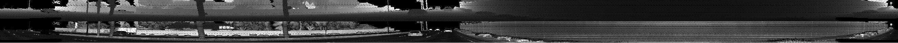

Next, we visualize the point cloud from the lidar data, following the general examples in lesson 3. The resulting point cloud initially shows an overhead view.

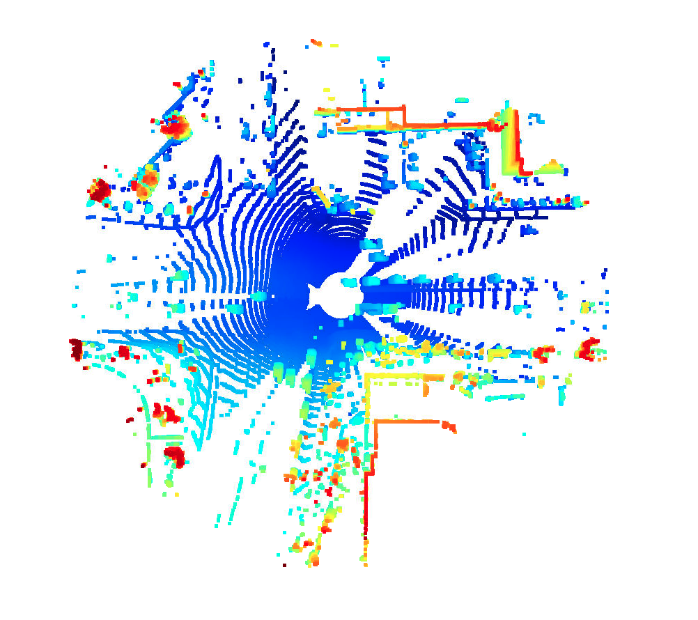

In open3d, allows the user to drag and zoom to change the perspective. Here we can get a better look at the vehicles in the point cloud.


In this we can make out more details of the nearby vehicles. For example, in front and too the right of our vehicle, we can see a pickup truck pulling a cargo trailer. We can generally see vehicle types (sedans, SUVs, trucks), and some vehicle features, like side mirrors, hoods, and trucks. The data is no precise enough to show specific car types. Also, some parts of vehicles are obscured by other objects (including other vehicles). We can also see some surroundings, like plants and edges of buildings.

The range image for this frame supports the observations in the point cloud. We can see trees, other cars, and in particular, that same pickup with the cargo trailer.

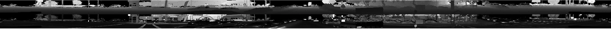

#### Step 1 Part 2 - Examining Point Cloud Examples

Below, we look closely at 10 point cloud examples, 6 from sequence 3, and 2 each from sequences 1 and 2.

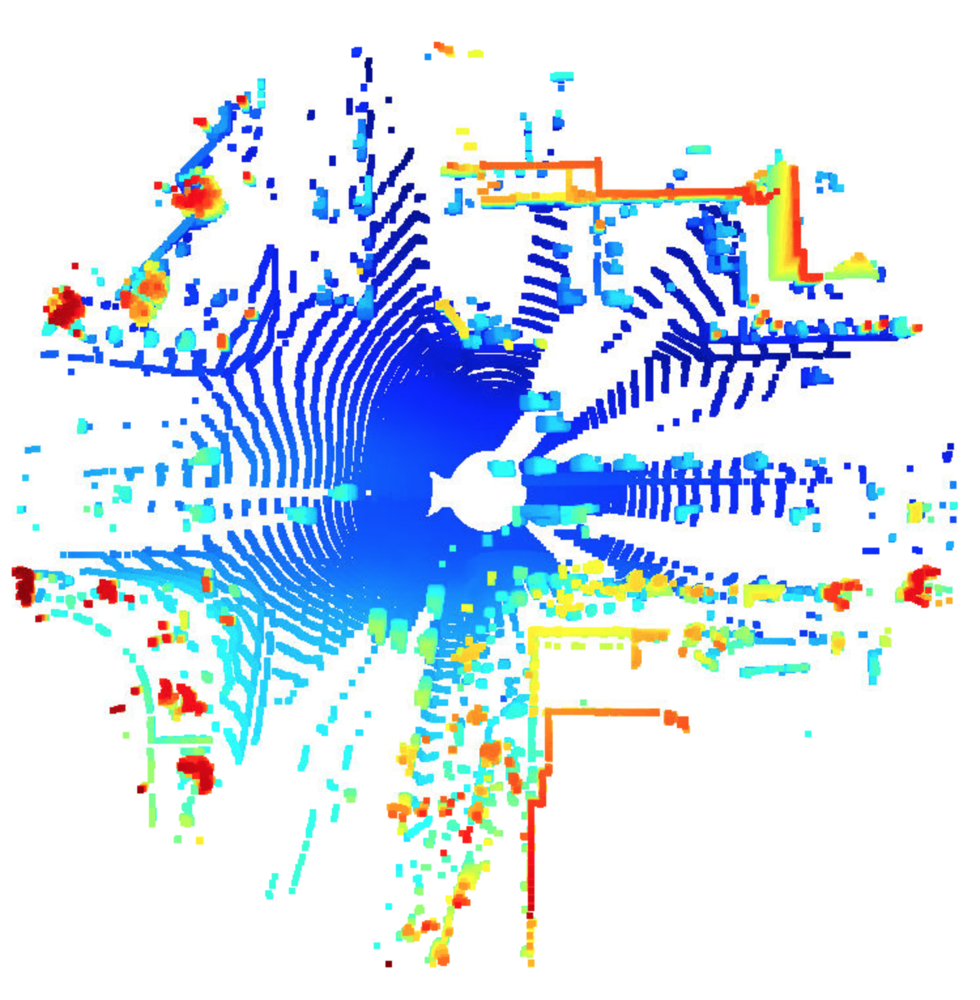

In the first frame of sequence 3, we start with the bird's eye view, and see that the lidar vehicle is passing through an intersection. It has a row of cars to its left, and what looks like a truck pulling a trailer to its right. We can clearly make out vehicles, and get some sense of vehicle type (ie truck vs car), but it is difficult to make out specific vehicle details, like make and model.

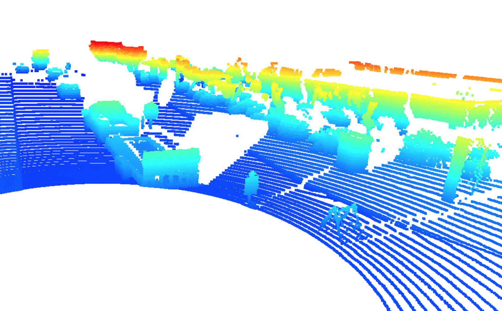

In the same frame, we can zoom in and change orientation to get a clearer view of the trailer to our right. It appears to be a flatbed cargo trailer, the kind that might be used to carry a car. We can also see that the folded ramp at the back of the trailer occludes the space further ahead and to the right. There are also two objects to the right and behind the trailer. This look like construction markers.


Rotating the view to the right and behind the lidar vehicle, we can see oncoming traffic from the intersection. There is also a faint outline of the curb, and objects on the sidewalk.


Moving ahead to frame 50 of the same sequence, the lidar vehicle is not alongside the truck with the trailer. Interestingly, the trailer is now much grainier, despite being close and not occluded. The lidar sensor still sees the trailer, but seems to be having trouble with resolution at this close of range.

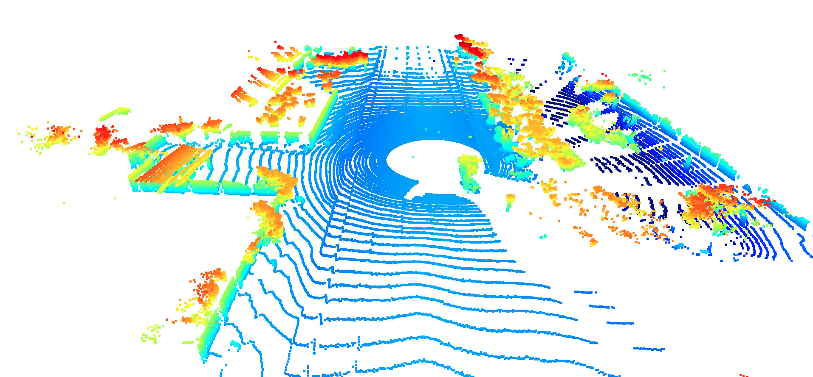

Zooming out from the same frame, and rotating to the left, we can see that we are passing another intersection. In this case, there appear to be tall walls, possibly buildings, along this side street, as indicated by the red points.

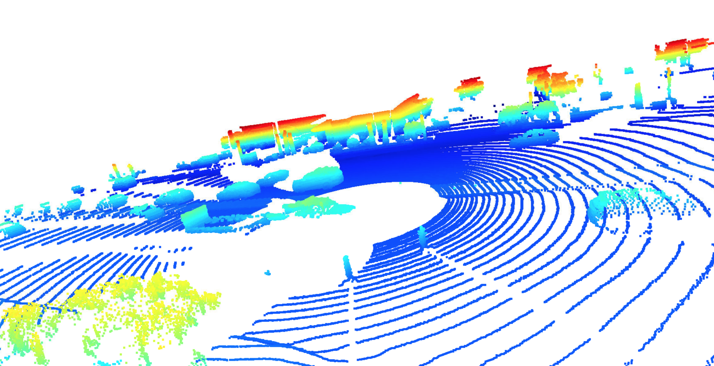

Rotating further to the left, we an see that the wall continues down the road. There is what looks like vegetation on the oppisite side of the street. Also, there are two object to the front right of the lidar vehicle (in the foreground from this perspective) that look like they could be people, based on size and height. However, there isn't sufficient resolution to positively identify them.

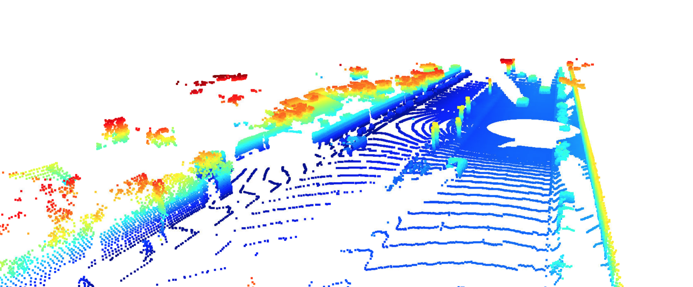

Moving to frame 0 of sequence 1, we can see different features of this road. There's a median with some kind of poles, possibly lights. There are also low walls on both sides of the road, and possibly vegetation to the left. There is less traffic in this example, but we can see a car behind, and several cars ahead.

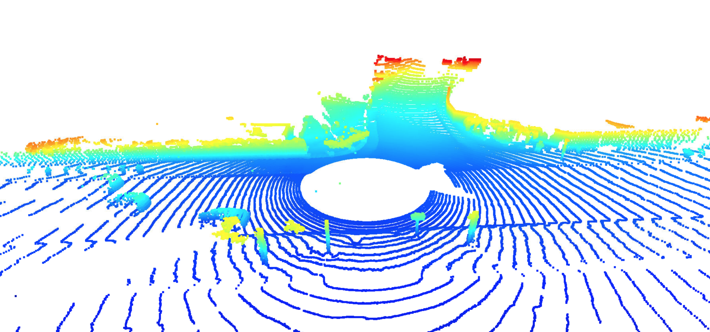

Moving to frame 50, there's something interesting. We're passing a side street on the right. But the point cloud gradually shifts to green and red down this side street, indicating that this is a steep hill.

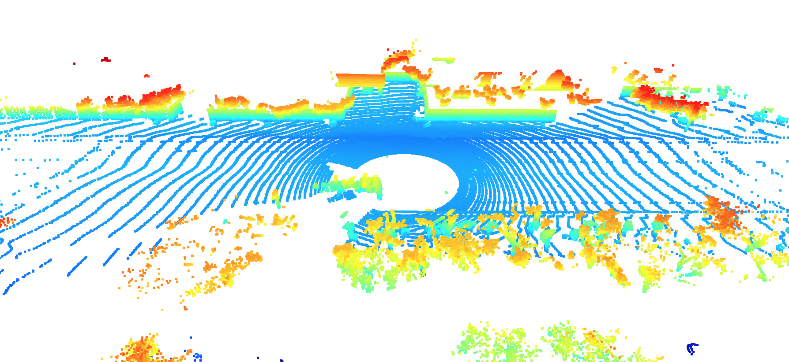

Finally, looking at sequence 2, we see a road mostly devoid of traffic, but with a lot of vegetation along the sides. This might be a less dense, possibly suburban, area.

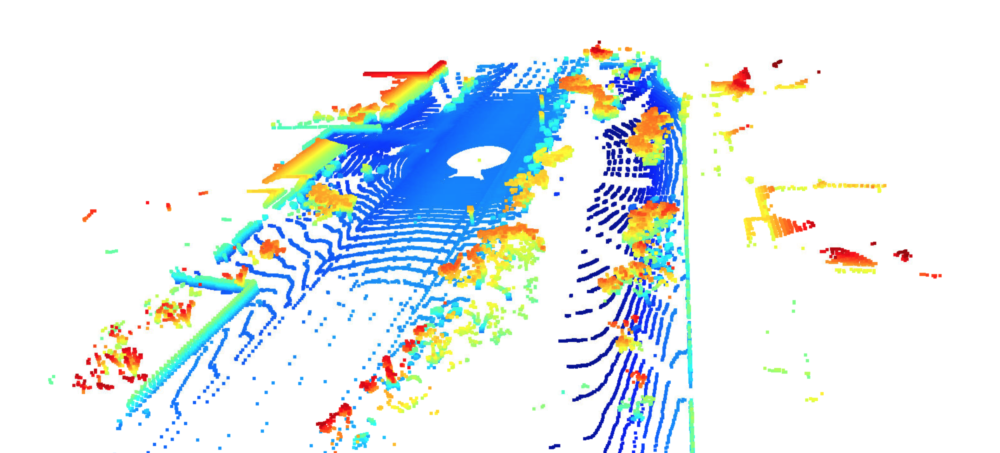

Later in the same sequence, we see an interesting shift in color to the right. While points on the road appear in light blue, and higher point appear in green, then yellow and red, here we see dark blue. This would seem to indicate there is a large ditch or ravine to the right of the vehicle.

Throughout these examples, general vehicle shapes are consistently visible. We can also get a good idea of height of vehicles. However, small details like side mirrors don't consistently appear. There are also regions around windows that don't appear on lidar.

Also, comparing the sequence 1 point clouds to the range images in part one, we can clear see the wall picked up to the left in both. There also appear to be a wall on the right, though the intensity is less. This comes through in the range image, where the right appears darker. Finally, we can see that there are objects on the median, but they are not light poles, they are trees.

### Step 2. Do you see any benefits in camera-lidar fusion compared to lidar-only tracking (in theory and in your concrete results)? 

Yes. While cameras are good at identifying objects, they don't provide direct ranging data. Lidar, on the other hand, gives precise ranging data, but less detail about the type of object it's detecting. By combining the two, we can create a detailed 3D map of specific objects, and their specific locations in that space. 

The lidar data used in this project supports this model. It provides precise that about the locations of surrounding objects, but it's not always clear what these obects are. For example, some of the objects on the sides of the road could be either vegetation, or pedestrians. Combining these data with cameras would give more precise object type data.

### Step 3. Code results

#### Step 1

The `show_range_image` function was created as follows:

```
def show_range_image(frame, lidar_name):

    ####### ID_S1_EX1 START #######     
    #######

    # step 1 : extract lidar data and range image for the roof-mounted lidar
    lidar = [obj for obj in frame.lasers if obj.name == lidar_name][0]
    
    # step 2 : extract the range and the intensity channel from the range image
    if len(lidar.ri_return1.range_image_compressed) > 0: # use first response
        ri = dataset_pb2.MatrixFloat()
        ri.ParseFromString(zlib.decompress(lidar.ri_return1.range_image_compressed))
        ri = np.array(ri.data).reshape(ri.shape.dims)
    
    # step 3 : set values <0 to zero
    ri[ri<0]=0.0
    
    # step 4 : map the range channel onto an 8-bit scale and make sure that the full range of values is appropriately considered
    ri_range = ri[:,:,0]
    ri_range = (ri_range * 255 / (np.max(ri_range) - np.min(ri_range))).astype(np.uint8)
    
    # step 5 : map the intensity channel onto an 8-bit scale and normalize with the difference between the 1- and 99-percentile to mitigate the influence of outliers
    ri_intensity = ri[:,:,1]
    p_1 = np.percentile(ri_intensity,1)
    p_99 = np.percentile(ri_intensity,99)
    ri_intensity = 255 * np.clip(ri_intensity, p_1, p_99)/p_99 
    ri_intensity = ri_intensity.astype(np.uint8)
    
    # step 6 : stack the range and intensity image vertically using np.vstack and convert the result to an unsigned 8-bit integer
    img_range_intensity = np.vstack((ri_range, ri_intensity)).astype(np.uint8)
    
    # focus on +/- 45° around the image center
    deg45 = int(ri_intensity.shape[1] / 8)
    ri_center = int(ri_intensity.shape[1]/2)
    ri_intensity = ri_intensity[:,ri_center-deg45:ri_center+deg45]
    
    return img_range_intensity
```

This function extracts the lidar data as described in lesson 2, removes outliers based on percentile, and narrows the width to the 90 degrees in front of the vehicle. The resulting image is


The `show_pcl` function is written as:

```
# visualize lidar point-cloud
def show_pcl(pcl):

    ####### ID_S1_EX2 START #######     
    #######
    

    # step 1 : initialize open3d with key callback and create window
    pcl_visualization = o3d.visualization.VisualizerWithKeyCallback()
    pcl_visualization.create_window()
    
    global key_press
    key_press = True
    def callback(pcl_visualization):
        global key_press
        print("key pressed")
        key_press = False
        return
    
    pcl_visualization.register_key_callback(262, callback)
    # step 2 : create instance of open3d point-cloud class
    point_cloud = o3d.geometry.PointCloud()
    
    # step 3 : set points in pcd instance by converting the point-cloud into 3d vectors (using open3d function Vector3dVector)
    point_cloud.points = o3d.utility.Vector3dVector(pcl[:,:3])
    # step 4 : for the first frame, add the pcd instance to visualization using add_geometry; for all other frames, use update_geometry instead
    pcl_visualization.add_geometry(point_cloud)
    # step 5 : visualize point cloud and keep window open until right-arrow is pressed (key-code 262)
    
    while key_press:
        pcl_visualization.poll_events()
        pcl_visualization.update_renderer()
```

This uses a point cloud method similar to that in lesson 2, along with a callback to exit the open3d window. The result is a 3D point cloud that the user can drag and zoom to explore. An image is provided below.


#### Step 2

The `bev_from_pcl` is written as:

```
def bev_from_pcl(lidar_pcl, configs, display=False):

    # remove lidar points outside detection area and with too low reflectivity
    mask = np.where((lidar_pcl[:, 0] >= configs.lim_x[0]) & (lidar_pcl[:, 0] <= configs.lim_x[1]) &
                    (lidar_pcl[:, 1] >= configs.lim_y[0]) & (lidar_pcl[:, 1] <= configs.lim_y[1]) &
                    (lidar_pcl[:, 2] >= configs.lim_z[0]) & (lidar_pcl[:, 2] <= configs.lim_z[1]))
    lidar_pcl = lidar_pcl[mask]
    
    # shift level of ground plane to avoid flipping from 0 to 255 for neighboring pixels
    lidar_pcl[:, 2] = lidar_pcl[:, 2] - configs.lim_z[0]  

    # convert sensor coordinates to bev-map coordinates (center is bottom-middle)

    ## step 1 :  compute bev-map discretization by dividing x-range by the bev-image height (see configs)
    bev_discret = (configs.lim_x[1] - configs.lim_x[0]) / configs.bev_height
    
    ## step 2 : create a copy of the lidar pcl and transform all metrix x-coordinates into bev-image coordinates    
    lidar_pcl_cpy = np.copy(lidar_pcl)
    lidar_pcl_cpy[:, 0] = np.int_(np.floor(lidar_pcl_cpy[:, 0] / bev_discret))
    
    # step 3 : perform the same operation as in step 2 for the y-coordinates but make sure that no negative bev-coordinates occur
    lidar_pcl_cpy[:, 1] = np.int_(np.floor(lidar_pcl_cpy[:, 1] / bev_discret) + configs.bev_width / 2)
    
    # step 4 : visualize point-cloud using the function show_pcl from a previous task
    if display:
        show_pcl(lidar_pcl_cpy)
    
    #######
    ####### ID_S2_EX1 END #######     
    
    
    # Compute intensity layer of the BEV map
    ####### ID_S2_EX2 START #######     
    #######
    # print("student task ID_S2_EX2")

    ## step 1 : create a numpy array filled with zeros which has the same dimensions as the BEV map
    intensity_map = np.zeros((configs.bev_height + 1, configs.bev_width + 1))
    
    # step 2 : re-arrange elements in lidar_pcl_cpy by sorting first by x, then y, then -z (use numpy.lexsort)
    lidar_pcl_cpy[lidar_pcl_cpy[:, 3] > 1.0, 3] = 1.0
    lidar_pcl_top = lidar_pcl_cpy[np.lexsort((-lidar_pcl_cpy[:, 2], lidar_pcl_cpy[:, 1], lidar_pcl_cpy[:, 0]))]
    
    ## step 3 : extract all points with identical x and y such that only the top-most z-coordinate is kept (use numpy.unique)
    ##          also, store the number of points per x,y-cell in a variable named "counts" for use in the next task
    _, indices = np.unique(lidar_pcl_cpy[:, 0:2], axis=0, return_index=True)
    lidar_pcl_top = lidar_pcl_cpy[indices]
    
    ## step 4 : assign the intensity value of each unique entry in lidar_top_pcl to the intensity map 
    ##          make sure that the intensity is scaled in such a way that objects of interest (e.g. vehicles) are clearly visible    
    ##          also, make sure that the influence of outliers is mitigated by normalizing intensity on the difference between the max. and min. value within the point cloud
    intensity_map[np.int_(lidar_pcl_top[:, 0]), np.int_(lidar_pcl_top[:, 1])] = \
                  lidar_pcl_top[:, 3] / (np.max(lidar_pcl_top[:, 3])-np.min(lidar_pcl_top[:, 3]))
    
    ## step 5 : temporarily visualize the intensity map using OpenCV to make sure that vehicles separate well from the background
    img_intensity = (intensity_map * 256).astype(np.uint8)
    if display:
        cv2.imshow('img_intensity', img_intensity)
        cv2.waitKey(0)
        cv2.destroyAllWindows()
    #######
    ####### ID_S2_EX2 END ####### 


    # Compute height layer of the BEV map
    ####### ID_S2_EX3 START #######     
    #######
    print("student task ID_S2_EX3")

    ## step 1 : create a numpy array filled with zeros which has the same dimensions as the BEV map
    height_map = np.zeros((configs.bev_height + 1, configs.bev_width + 1))
    
    ## step 2 : assign the height value of each unique entry in lidar_top_pcl to the height map 
    ##          make sure that each entry is normalized on the difference between the upper and lower height defined in the config file
    ##          use the lidar_pcl_top data structure from the previous task to access the pixels of the height_map
    height_map[np.int_(lidar_pcl_top[:, 0]), np.int_(lidar_pcl_top[:, 1])] = lidar_pcl_top[:, 2] / float(configs.lim_z[1] - configs.lim_z[0])
    
    ## step 3 : temporarily visualize the intensity map using OpenCV to make sure that vehicles separate well from the background
    img_height = (height_map * 256).astype(np.uint8)
    if display:
        cv2.imshow('height_map', height_map)
        cv2.waitKey(0)
        cv2.destroyAllWindows()
    #######
    ####### ID_S2_EX3 END #######       
    
    # Compute density layer of the BEV map
    density_map = np.zeros((configs.bev_height + 1, configs.bev_width + 1))
    _, counts = np.unique(lidar_pcl_cpy[:, 0:2], axis=0, return_counts=True)
    density_map[np.int_(lidar_pcl_top[:, 0]), np.int_(lidar_pcl_top[:, 1])] = np.minimum(1.0, np.log(counts + 1) / np.log(64)) 
        
    # assemble 3-channel bev-map from individual maps
    bev_map = np.zeros((3, configs.bev_height, configs.bev_width))
    bev_map[2, :, :] = density_map[:configs.bev_height, :configs.bev_width]  # r_map
    bev_map[1, :, :] = height_map[:configs.bev_height, :configs.bev_width]  # g_map
    bev_map[0, :, :] = intensity_map[:configs.bev_height, :configs.bev_width]  # b_map

    # expand dimension of bev_map before converting into a tensor
    s1, s2, s3 = bev_map.shape
    bev_maps = np.zeros((1, s1, s2, s3))
    bev_maps[0] = bev_map

    bev_maps = torch.from_numpy(bev_maps)  # create tensor from birds-eye view
    input_bev_maps = bev_maps.to(configs.device, non_blocking=True).float()
    return input_bev_maps
    
```

This follows the method described in lesson 3. We create an initial point cloud by flooring at zero and normalizing the height. 

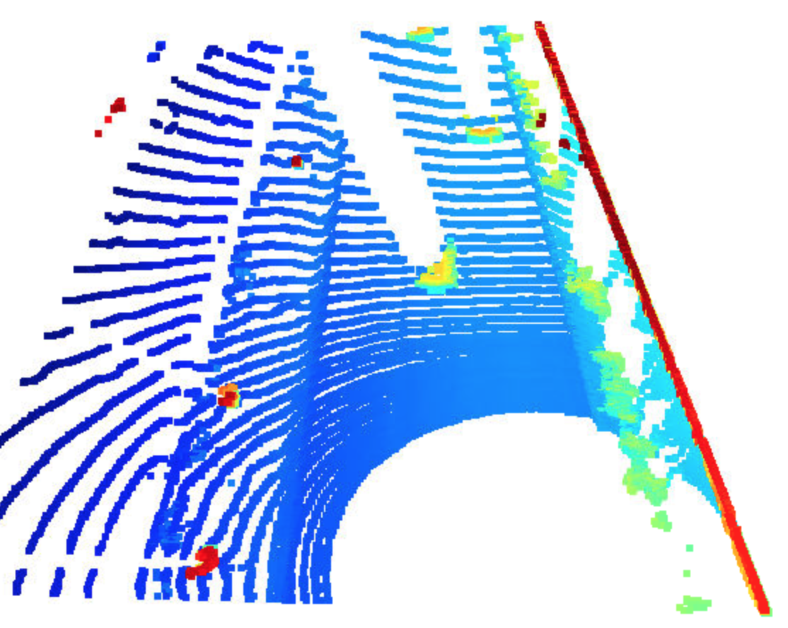

We then map on the point intensity and add the height layer.

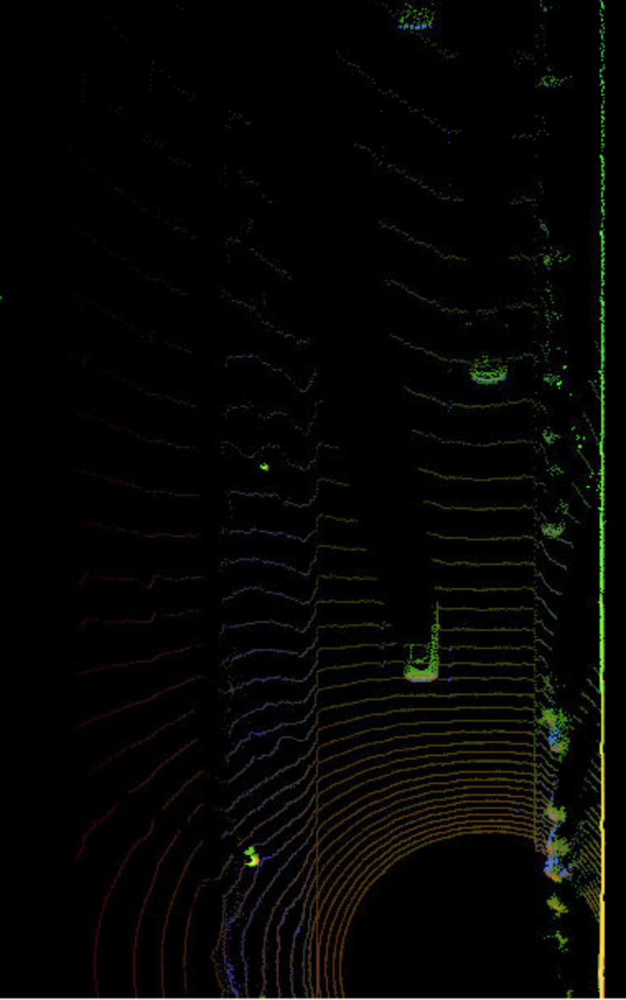

#### Step 3

Next, we actually detect objects by loading the model from the SFA3D repo. 

The `load_configs_model` function is modified as:

```
        configs.model_path = os.path.join(parent_path, 'tools', 'objdet_models', 'resnet')
        configs.pretrained_filename = os.path.join(configs.model_path, 'pretrained', 'fpn_resnet_18_epoch_300.pth')
        configs.arch = 'fpn_resnet'
        configs.num_layers = 18
        configs.K = 50
        configs.batch_size = 4
        configs.conf_thresh = 0.5
        configs.nms_thresh = 0.4
        configs.num_workers = 4
        
        configs.pin_memory = True
        configs.distributed = False  # For testing on 1 GPU only

        configs.input_size = (608, 608)
        configs.hm_size = (152, 152)
        configs.down_ratio = 4
        configs.max_objects = 50
        
        configs.output_format = 'image'
        configs.output_video_fn = 'out_fpn_resnet'

        configs.imagenet_pretrained = False
        configs.head_conv = 64
        configs.num_classes = 3
        configs.num_center_offset = 2
        configs.num_z = 1
        configs.num_dim = 3
        configs.num_direction = 2  # sin, cos

        configs.heads = {
            'hm_cen': configs.num_classes,
            'cen_offset': configs.num_center_offset,
            'direction': configs.num_direction,
            'z_coor': configs.num_z,
            'dim': configs.num_dim
            }
        configs.num_input_features = 4
```

`create_model`

```
elif 'fpn_resnet' in configs.arch:
        print('using ResNet architecture with feature pyramid')
        
        ####### ID_S3_EX1-4 START #######     
        #######
        print("student task ID_S3_EX1-4")
        model = fpn_resnet.get_pose_net(num_layers=configs.num_layers, heads=configs.heads, head_conv=configs.head_conv,
                                        imagenet_pretrained=configs.imagenet_pretrained)
```

`detect_objects`

```
        elif 'fpn_resnet' in configs.arch:
            # decode output and perform post-processing
            
            ####### ID_S3_EX1-5 START #######     
            #######
            print("student task ID_S3_EX1-5")
            outputs['hm_cen'] = torch.sigmoid(outputs['hm_cen'])
            outputs['cen_offset'] = torch.sigmoid(outputs['cen_offset'])
            detections = decode(outputs['hm_cen'],outputs['cen_offset'],outputs['direction'],outputs['z_coor'],outputs['dim'],K=configs.K)
            detections = detections.cpu().numpy().astype(np.float32)
            detections = post_processing(detections, configs) 
            detections = detections[0][1]
            #######
            ####### ID_S3_EX1-5 END #######  
```

The resulting image places boxes around the detected vehicles:

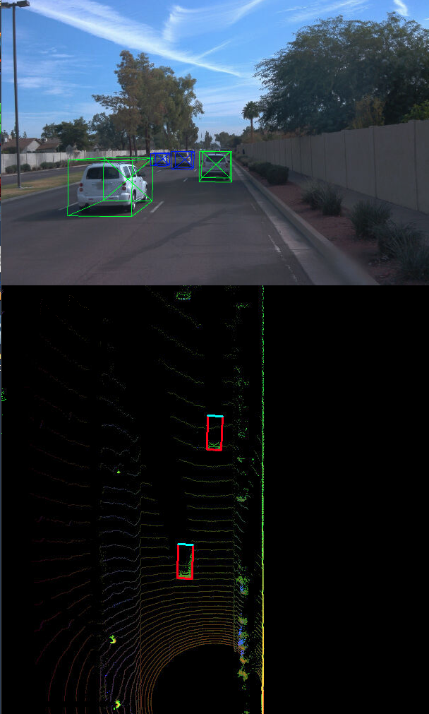

#### Step 4

Finally, we evaluate the results using the MaP score.

The following section is added to the `measure_detection_performance` function:

```
            ####### ID_S4_EX1 START #######     
            #######
            print("student task ID_S4_EX1 ")

            ## step 1 : extract the four corners of the current label bounding-box
            bbox1 = tools.compute_box_corners(label.box.center_x, 
                                              label.box.center_y, 
                                              label.box.width, 
                                              label.box.length, 
                                              label.box.heading)
            ## step 2 : loop over all detected objects
            for an_obj in detections:
                ## step 3 : extract the four corners of the current detection
                obj_id, x_coor, y_coor, z_coor, h_coor, w_obj, l_obj, yaw_obj = an_obj
                bbox2 = tools.compute_box_corners(x_coor, y_coor, w_obj, l_obj, yaw_obj)
                ## step 4 : compute the center distance between label and detection bounding-box in x, y, and z
                diff_x = np.array(label.box.center_x - x_coor).item()
                diff_y = np.array(label.box.center_y - y_coor).item()
                diff_z = np.array(label.box.center_z - z_coor).item()
                ## step 5 : compute the intersection over union (IOU) between label and detection bounding-box
                poly1 = Polygon(bbox1)
                poly2 = Polygon(bbox2)
                intersection = poly1.intersection(poly2).area 
                union = poly1.union(poly2).area
                iou = intersection / union
                ## step 6 : if IOU exceeds min_iou threshold, store [iou,dist_x, dist_y, dist_z] in matches_lab_det and increase the TP count
                if iou > min_iou:
                    matches_lab_det.append([iou,diff_x, diff_y, diff_z ])
            #######
            ####### ID_S4_EX1 END ####### 
```

For each box, we compute the intersection over union versus the ground truth. If the IoU is above the min_iou threshold, we add that box to our detection matches.

Next, we compute the precision and recall by further modifying the `measure_detection_performance` function:

```
    print("student task ID_S4_EX2")
    
    # compute positives and negatives for precision/recall
    
    ## step 1 : compute the total number of positives present in the scene
    all_positives = labels_valid.sum()

    ## step 2 : compute the number of false negatives
    true_positives=len(ious)
    false_negatives = all_positives - true_positives

    ## step 3 : compute the number of false positives
    false_positives = len(detections) - true_positives
    
    #######
    ####### ID_S4_EX2 END #######     
    
    pos_negs = [all_positives, true_positives, false_negatives, false_positives]
    det_performance = [ious, center_devs, pos_negs]
    
    return det_performance
```

And the `compute_performance_stats` function:

```
    ####### ID_S4_EX3 START #######     
    #######    
    print('student task ID_S4_EX3')

    ## step 1 : extract the total number of positives, true positives, false negatives and false positives
    ap = sum(pos_negs[:,0])
    tp = sum(pos_negs[:,1])
    fn = sum(pos_negs[:,2])
    fp = sum(pos_negs[:,3])
    
    ## step 2 : compute precision
    precision = tp /(tp + fp)

    ## step 3 : compute recall 
    recall = tp /(tp + fn)

    #######    
    ####### ID_S4_EX3 END ####### 
```

On the darknet model, we get a precision of .95 and a recall of .94


