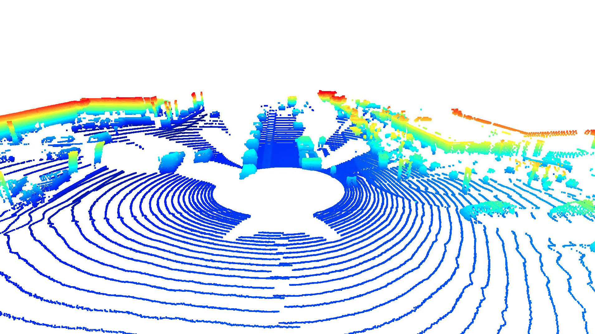
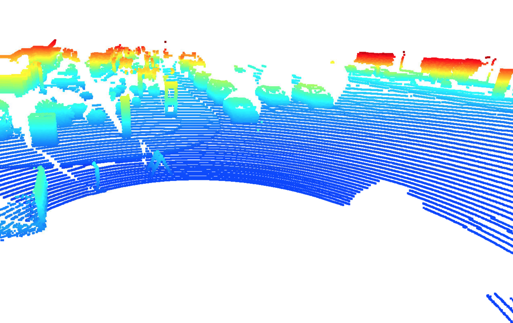
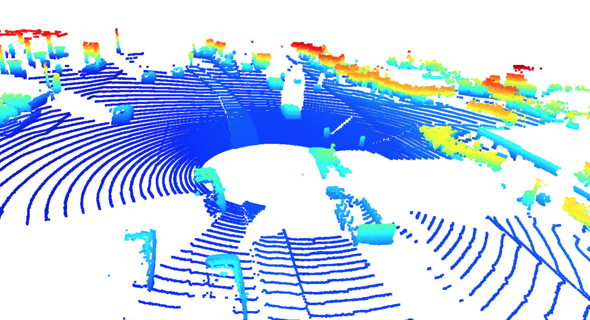

# Writeup: Track 3D-Objects Over Time

Please use this starter template to answer the following questions:

### 1. Write a short recap of the four tracking steps and what you implemented there (filter, track management, association, camera fusion). Which results did you achieve? Which part of the project was most difficult for you to complete, and why?

#### Step 1 - Visualizing Range and Point Cloud Data

The first part of this section involved visualizing range data using code similar to sections 12-18 of lesson 2. The lidar data is extracted from the frame, parsed, and converted to a numpy array. Negative values are removed (since these indicate non-returned values), converted to an image, and cropped to the 90 degrees in front of the vehicle. The results looks like:

Next, we visualize the point cloud from the lidar data, following the general examples in lesson 3. The resulting point cloud initially shows an overhead view.

In open3d, allows the user to drag and zoom to change the perspective. Here we can get a better look at the vehicles in the point cloud.

In this we can make out more details of the nearby vehicles. For example, in front and too the right of our vehicle, we can see a pickup truck pulling a cargo trailer. We can generally see vehicle types (sedans, SUVs, trucks), and some vehicle features, like side mirrors, hoods, and trucks. The data is no precise enough to show specific car types. Also, some parts of vehicles are obscured by other objects (including other vehicles). We can also see some surroundings, like plants and edges of buildings.

The range image for this frame supports the observations in the point cloud. We can see trees, other cars, and in particular, that same pickup with the cargo trailer.

Looking at different point cloud examples, we can see different degrees of visibility, due to surroundings.

These two point clouds from the first scene show a truck pulling a cargo trailer to the front and right of the vehicle.

In both of these point clouds, edges of cars facing the sensor vehicle appear clearly, though bumpers sometimes don't, if they are all or partially obscured by other objects.

These point clouds from the second scene show a slightly different angle where we can see the edges of the road, cars in front of the sensor vehicle, and what appear to be light poles on the median. The lidar intensity image at the top of this report is taken from the same scene, and also shows similar road boundaries, as well as cars in the area ahead.

In the third scene, from a slightly higher angle, we can see the sorrounding vegetation, and some of the buildings.

### 2. Do you see any benefits in camera-lidar fusion compared to lidar-only tracking (in theory and in your concrete results)? 

Yes. While cameras are good at identifying objects, they don't provide direct ranging data. Lidar, on the other hand, gives precise ranging data, but less detail about the type of object it's detecting. By combining the two, we can create a detailed 3D map of specific objects, and their specific locations in that space. 

The lidar data used in this project supports this model. It provides precise that about the locations of surrounding objects, but it's not always clear what these obects are. For example, some of the objects on the sides of the road could be either vegetation, or pedestrians. Combining these data with cameras would give more precise object type data.

### 3. Which challenges will a sensor fusion system face in real-life scenarios? Did you see any of these challenges in the project?

### 4. Can you think of ways to improve your tracking results in the future?

